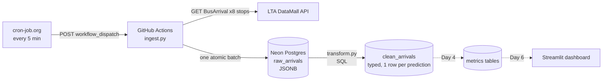

# Project Log: sg-bus-reliability

> **Is the bus app lying to you?** Measuring ETA accuracy and service reliability for Singapore buses.

This is the engineering log for the project. It records what was built, the problems hit, how each was diagnosed and fixed, and how the work maps to core data engineering concepts.

**Status:** Day 2 of 7. Ingestion is live in the cloud; the raw → clean transform is working.

---

## 1. The question

Which bus services are least reliable, and when?

Concretely:
- **ETA accuracy:** when the app says "5 min", how late does the bus actually arrive?
- **Headway gaps:** how long do riders really wait between consecutive buses on a service?
- **Bunching:** how often do two buses on the same service arrive together, followed by a long gap?
- **Ghost buses:** how often does a predicted bus disappear from the feed without ever arriving?

None of these are published anywhere. LTA's API only gives live predictions, so answering them requires collecting snapshots over time and reconstructing what actually happened.

---

## 2. Architecture

| Layer | Table | Grain | Purpose |
|---|---|---|---|
| Raw | `raw_arrivals` | 1 row per stop per poll | Exact API response, never modified. The replay source if any later logic is wrong. |
| Clean | `clean_arrivals` | 1 row per (poll, stop, service, slot) | Flattened, typed, null-handled, deduplicated. |
| Metrics | *(planned)* | per service / stop / hour | Reliability answers. |

---

## 3. Tech stack

| Tool | Role | Why this and not something else |
|---|---|---|
| **Python** (`requests`, `psycopg`) | Extract + load | The industry default for ingestion code. Small enough that every line can be explained. |
| **LTA DataMall API** | Source | Free, real, live, and messy enough to need real cleaning. |
| **PostgreSQL (Neon, serverless)** | Storage + transform engine | Free tier with no credit card, Singapore region. `JSONB` lets raw responses be stored as-is and parsed in SQL later. |
| **SQL** | Transformations | Transform inside the database (ELT). SQL is the language every DE interview tests. |
| **GitHub Actions** | Compute / job runner | Free on public repos; secrets management built in; runs without a laptop being on. |
| **cron-job.org** | Scheduler | GitHub's own cron proved unreliable (see Incident 6). An external trigger calling `workflow_dispatch` is precise. |
| **Git + GitHub** | Version control | Code, SQL and pipeline config are all versioned together. |

**Deliberately not used (yet):** Spark, Kafka, Airflow, dbt. At this data volume (≈100 KB per poll) they add complexity without solving a real problem. The plan is to introduce each one only once the pain it solves is felt. For example, dbt arrives once there are enough SQL models that dependency ordering and testing become painful by hand.

---

## 4. Data model

### `raw_arrivals`
| Column | Type | Notes |
|---|---|---|
| `id` | `BIGSERIAL` | Surrogate key |
| `polled_at` | `TIMESTAMPTZ` | One timestamp per run, stored in UTC |
| `bus_stop_code` | `TEXT` | 5-digit LTA stop code |
| `payload` | `JSONB` | Full API response, untouched |

Unique on `(bus_stop_code, polled_at)`.

### `clean_arrivals`
| Column | Type | Notes |
|---|---|---|
| `polled_at`, `bus_stop_code`, `service_no`, `slot` | | **Primary key.** `slot` 1–3 = next bus / 2nd / 3rd |
| `estimated_arrival` | `TIMESTAMPTZ` | Parsed from ISO-8601 string |
| `minutes_away` | `NUMERIC(6,1)` | Derived: ETA minus poll time |
| `is_monitored` | `BOOLEAN` | `true` = live GPS, `false` = timetable estimate |
| `latitude`, `longitude` | `DOUBLE PRECISION` | `"0.0"` and `""` mapped to `NULL` (no GPS fix) |
| `crowd_level`, `bus_type`, `is_wheelchair_ok` | | Decoded from LTA codes |
| `origin_code`, `destination_code`, `visit_number` | | Route context; `visit_number = 2` on loop services |

---

## 5. Work log

### Day 1 (4–5 Oct 2026): Ingestion
- Called the LTA BusArrival v3 API and inspected the response shape.
- Moved the API key out of source code into `.env`, excluded from Git via `.gitignore`.
- Wrote `ingest.py`: polls 8 stops per run, with one shared timestamp so each run is a consistent snapshot.
- Moved storage from local files to Neon Postgres and the job from a laptop to GitHub Actions.
- Restructured the script into separate **extract** and **load** phases after a mid-run connection drop (Incident 4).
- First cloud run succeeded: 8 stops, saved in about 15 s.

### Day 2 (7 Oct 2026): Monitoring, a scheduler fix, and the clean layer
- Audited two days of collection and found 14 snapshots where about 700 were expected (Incident 6).
- Replaced GitHub's scheduler with an external trigger. Verified runs now fire on the 5-minute mark.
- Wrote `sql/clean_arrivals.sql` and `transform.py`: 112 raw rows → 4,318 clean rows.
- Validated the transform: the row count matches an independent count of non-empty predictions in the raw JSON, there are zero nulls in key columns, and a rerun adds zero rows.
- Profiled the data and found that interchange stops are almost entirely timetable estimates (Incident 7).
- Wrote `explore_route.py` to query LTA's route reference data (≈26k rows, paginated), and used it to model the commute and pick 9 stops.

---

## 6. Problems faced and how they were solved

Each entry follows **symptom → root cause → fix → lesson**.

### Incident 1: API key hard-coded in source
- **Symptom:** the first test script had the key inline. Pushing it to a public repo would leak it.
- **Fix:** `.env` file plus `python-dotenv` locally, and GitHub Actions encrypted secrets in CI. `.gitignore` excludes `.env`, and `git status` is checked before the first commit.
- **Lesson:** secrets never live in code. The same code reads config from the environment, whether it runs locally or in CI.

### Incident 2: where should the pipeline run?
- **Symptom:** a local cron job would need the laptop on and awake for 7 days, and thousands of small files would sync to OneDrive.
- **Fix:** GitHub Actions as the runner and Neon Postgres as the store. The laptop is only needed for development.
- **Lesson:** separate **compute** (what runs the job) from **storage** (where data lives). Either can then be swapped independently.

### Incident 3: hidden environment differences between local and scheduled runs
- **Symptom (anticipated):** schedulers run scripts from a different working directory, so relative paths like `data/raw` would write somewhere unexpected. GitHub runners also run in UTC, not SGT.
- **Fix:** resolve all paths from the script's own location (`Path(__file__).parent`), and store all timestamps as `TIMESTAMPTZ` in UTC, converting to `Asia/Singapore` only when querying.
- **Lesson:** never rely on the current directory or the machine's timezone. Store UTC and display local.

### Incident 4: database connection dropped mid-run, and the whole run was lost
- **Symptom:** `psycopg.OperationalError: server closed the connection unexpectedly` after the first insert. A follow-up check showed the table didn't exist, because the transaction rolled back everything, including the `CREATE TABLE`.
- **Root cause:** the compute was resized during the run, which restarts the Neon endpoint. The design made it worse: the script held a DB connection open while waiting on slow HTTP calls to LTA.
- **Fix:** split into two phases. **Extract** fetches all stops into memory with no DB connection open. **Load** opens one short connection and inserts everything as a single transaction with `executemany`. Per-stop HTTP failures are caught and logged, so one bad stop doesn't kill the run.
- **Lesson:** keep connections short, and make each batch **atomic**: a run is either fully saved or not at all. A half-saved snapshot would silently bias every metric downstream.

### Incident 5: push rejected for the workflow file
- **Symptom:** `refusing to allow an OAuth App to create or update workflow ... without 'workflow' scope`.
- **Fix:** `gh auth refresh -s workflow`.
- **Lesson:** files that execute code on someone else's infrastructure are permission-gated separately from ordinary code. Least privilege in practice.

### Incident 6: the scheduler silently skipped about 98% of runs
- **Symptom:** after about 2.5 days there were only **14 snapshots** instead of about 700. Every run that did happen succeeded, so nothing looked broken.
- **Diagnosis:** a gap analysis on `polled_at` using `LAG()` showed gaps of mostly 4–8.5 hours between snapshots. The GitHub run history confirmed that only 12 scheduled runs were triggered in that window. GitHub's `schedule` event is best-effort and gets heavily throttled under load.
- **Fix:** an external scheduler (cron-job.org) calls GitHub's `workflow_dispatch` REST endpoint every 5 minutes, authenticated with a fine-grained token scoped to **Actions: write on this one repo only**. The GitHub cron stays as a fallback. Verified: runs now land on the 5-minute mark.
- **Lesson:** **"all runs succeeded" is not the same as "the pipeline is healthy."** Monitor freshness and volume, not just job status. This becomes an automated check on Day 5.

### Incident 7: the chosen stops mostly measure the timetable, not reality
- **Symptom:** while profiling `clean_arrivals`:

  | Stop type | Predictions with live GPS |
  |---|---|
  | Bus interchanges (6 stops) | **6.3%** |
  | Mid-route stops (2 stops) | **80.1%** |

- **Root cause:** at an interchange the bus hasn't departed yet, so the API returns the scheduled departure time. Interchange data says almost nothing about reliability.
- **Fix:** re-scoped the stop list around a real commute (home → NUS Central Library), which has two alternative routes:
  - **Route A:** bus 61 → Opp Maju Camp → bus 151
  - **Route B:** bus 157/174/970 → Opp King Albert Pk → 130 m walk → King Albert Pk Stn → bus 151

  Stops were chosen from LTA's `BusRoutes` reference data, not by hand: boarding, transfer and alighting stops for both routes, plus upstream and midpoint stops to see where delay builds. Live-GPS coverage on the next bus went from **6% to 97%** (63 of 65).
- **Lesson:** **profile the data before building metrics on it.** The bias would have quietly flattened every reliability number.

### Smaller gotchas
- **Paginated downloads dropped mid-way:** about 50 back-to-back requests, each on a new connection, got reset by the server at around 14k rows. Fix: one reused `requests.Session` with automatic retries and exponential backoff.
- **TLS inspection by antivirus:** Norton re-signs HTTPS traffic for some processes, and Python's `certifi` bundle doesn't trust its root certificate, so requests failed with `CERTIFICATE_VERIFY_FAILED`. Fix: add the inspector's CA to a custom `REQUESTS_CA_BUNDLE`, never `verify=False`. This is the same issue corporate proxies cause.
- **Windows PowerShell encoding:** `echo "x" > file` writes UTF-16, which Python and Git can mis-read. Use `Set-Content -Encoding ascii`.
- **Serverless compute budget:** polling every 5 min keeps Neon's compute from ever sleeping. It's capped at 0.25 CU: ≈6 CU-hours/day against a 100/month free allowance, which is fine for about 2 weeks. The plan beyond that is to reduce the polling frequency.
- **Secret hygiene:** credentials were briefly pasted into a chat during setup. Practice adopted: redact secrets before sharing logs or screenshots, and rotate any credential that leaks.

---

## 7. Data engineering concepts demonstrated

| Concept | Where it shows up |
|---|---|
| **Ingestion / extract** | `ingest.py` polling a REST API |
| **ELT** (load raw, transform in the warehouse) | Raw JSON loaded first; all parsing done in SQL inside Postgres |
| **Raw / clean layers** (bronze / silver) | `raw_arrivals` is immutable; `clean_arrivals` is derived and can be rebuilt any time |
| **Schema-on-read** | `JSONB` stores the response as-is; structure is applied at transform time |
| **Idempotency** | `ON CONFLICT DO NOTHING` on natural keys; reruns produce no duplicates (verified) |
| **Atomicity** | Each ingest run is a single transaction |
| **Grain** | Each table has an explicit "one row = one ..." definition and a matching primary key |
| **Semi-structured flattening** | `jsonb_array_elements` + `LATERAL` + `VALUES` to unpivot `NextBus/2/3` |
| **Data typing and null handling** | Strings → `TIMESTAMPTZ` / `BOOLEAN` / `DOUBLE PRECISION`; sentinel values (`""`, `"0.0"`) → `NULL` |
| **Orchestration and scheduling** | External cron → `workflow_dispatch` → job |
| **Observability** | Gap analysis on `polled_at` caught the silent scheduler failure |
| **Data profiling** | GPS-coverage split by stop type caught a sampling bias |
| **Secrets management** | `.env` locally, encrypted CI secrets, least-privilege tokens |
| **Cost awareness** | Compute capped and budgeted against free-tier limits |
| **Timezone handling** | Store UTC, present SGT |

---

## 8. Lessons learnt

1. **Keep raw data untouched.** Every cleaning decision can be wrong; raw data is what lets you replay and fix it.
2. **Green checkmarks lie.** Every run "succeeded", yet the pipeline collected about 2% of the intended data. Measure outcomes (row counts, freshness, gaps), not job status.
3. **Profile before you model.** Six of eight stops turned out to be measuring the timetable.
4. **Design for failure.** Networks drop and databases restart. Short connections, atomic batches and per-item error handling turn crashes into non-events.
5. **Use the simplest tool that works, and know what would make you upgrade.** Plain Python and SQL handle this volume. Each heavier tool should earn its place by solving a problem you've actually hit.
6. **Free tiers have sharp edges.** Best-effort schedulers and compute that never sleeps both need to be understood before you rely on them.

---

## 9. Roadmap

| Day | Work | Concepts |
|---|---|---|
| 3 | Add `dim_stops` and `dim_routes` from LTA reference APIs; model the two commute routes | Dimensional modelling, reference data |
| 4 | Metrics: ETA error, headways (`LAG`), bunching, ghost buses (gaps-and-islands) | Window functions, sessionisation |
| 5 | Data quality checks that fail the pipeline: freshness, volume vs expected, nulls, uniqueness | Data contracts, observability |
| 6 | Incremental transform (process only new raw rows); Streamlit dashboard | Incremental loads, serving layer |
| 7 | README: architecture, how to run, trade-offs, scaling | Communication |

### What would break at 100× scale (800 stops)
- **API rate limits:** sequential requests would no longer fit in a 5-minute window. You'd need concurrency, backoff and rate limiting.
- **Full-table transforms:** reprocessing all raw rows every run gets slow. You'd move to incremental processing keyed on `polled_at`.
- **Storage:** raw JSONB would outgrow the free tier within days. You'd move raw data to object storage (S3/Parquet), partitioned by date, and keep only the modelled tables in Postgres.
- **Scheduling:** a single cron-triggered job has no retries, backfills or dependency management. This is the point where Airflow (or similar) earns its place.
